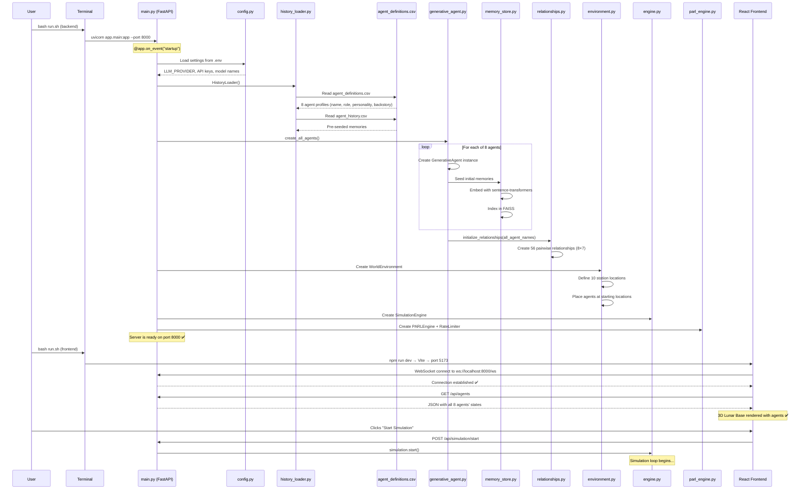
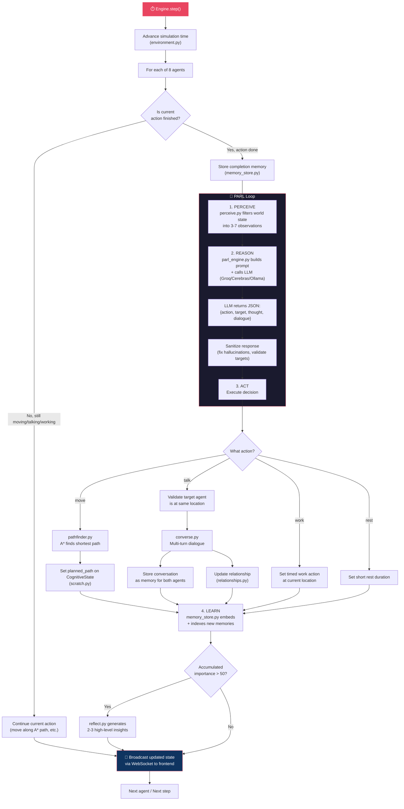
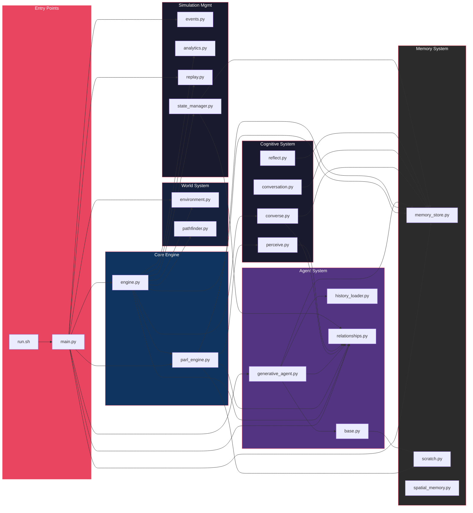
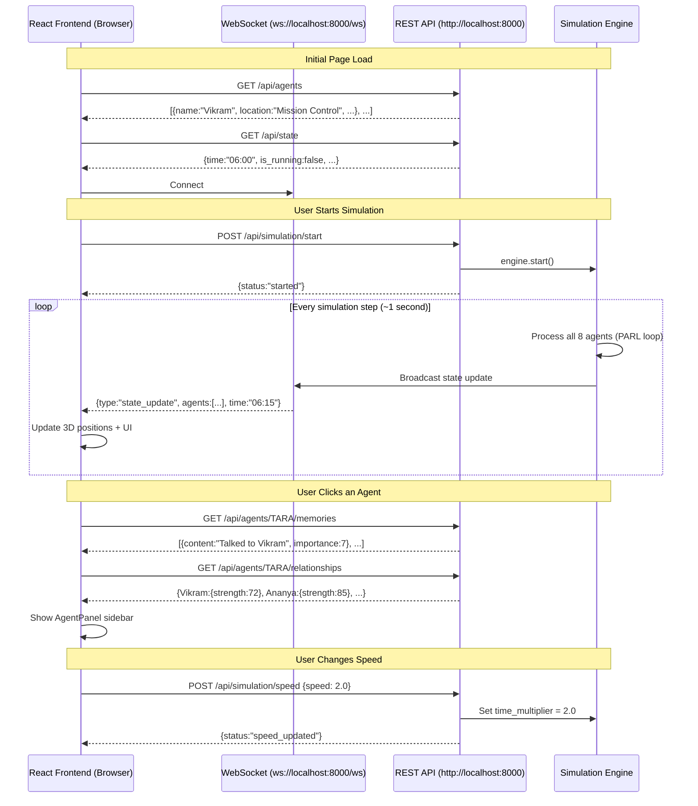
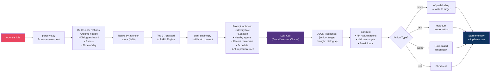

# ISRO Chandrayaan-5 — Project Architecture & Flow Diagrams

---

## 1. High-Level System Architecture

```mermaid
graph TB
    subgraph Frontend["🖥️ Frontend (React + Three.js)"]
        UI["App.jsx — Main UI"]
        LB["LunarBase.jsx — 3D Scene"]
        FB["FuturisticBuildings.jsx — 3D Buildings"]
        AP["AgentPanel.jsx — Agent Sidebar"]
        LI["LocationInterior.jsx — Location Panel"]
        WS_HOOK["useWebSocket.js — WebSocket Hook"]
        API_SVC["api.js — REST Client"]
    end

    subgraph Backend["⚙️ Backend (Python FastAPI)"]
        MAIN["main.py — FastAPI App + Endpoints"]
        CONFIG["config.py — Settings + Env Vars"]

        subgraph SimLayer["Simulation Layer"]
            ENGINE["engine.py — Simulation Loop"]
            EVENTS["events.py — Event Injector"]
            ANALYTICS["analytics.py — Info Propagation"]
            REPLAY["replay.py — Record/Playback"]
            STATE_MGR["state_manager.py — Save/Load"]
        end

        subgraph AgentLayer["Agent Layer"]
            GEN_AGENT["generative_agent.py — Agent Class"]
            BASE["base.py — BaseAgent + Memory"]
            HISTORY["history_loader.py — CSV Loader"]
            RELS["relationships.py — Social Graph"]
        end

        subgraph CogLayer["Cognitive Layer"]
            PERCEIVE["perceive.py — Perception Engine"]
            CONVERSE["converse.py — Conversation Choreographer"]
            CONV_MGR["conversation.py — Conversation Manager"]
            REFLECT["reflect.py — Reflection Engine"]
        end

        subgraph PARLLayer["PARL Engine"]
            PARL["parl_engine.py — LLM Decision Making"]
            PLANNER["planner.py — Daily Planner"]
            STAN_PLAN["stanford_planning.py — Stanford Planner"]
        end

        subgraph MemLayer["Memory Layer"]
            MEM_STORE["memory_store.py — FAISS + Embeddings"]
            SCRATCH["scratch.py — CognitiveState"]
            SPATIAL["spatial_memory.py — Mental Map"]
        end

        subgraph WorldLayer["World Layer"]
            ENV["environment.py — Station + Time"]
            PATHFIND["pathfinder.py — A* Navigation"]
        end
    end

    subgraph External["☁️ External Services"]
        GROQ["Groq Cloud API"]
        CEREBRAS["Cerebras Cloud API"]
        OLLAMA["Ollama (Local LLM)"]
        FAISS_LIB["FAISS Library"]
        SENT_TRANS["sentence-transformers"]
    end

    subgraph Data["📁 Data Files"]
        DEF_CSV["agent_definitions.csv"]
        HIST_CSV["agent_history.csv"]
        MEM_DIR["memories/ (FAISS indices)"]
        SAVE_DIR["saves/ (snapshots)"]
        REC_DIR["simulations/ (recordings)"]
    end

    UI --> LB
    UI --> AP
    UI --> LI
    LB --> FB
    UI --> WS_HOOK
    UI --> API_SVC

    API_SVC -- "REST HTTP" --> MAIN
    WS_HOOK -- "WebSocket" --> MAIN

    MAIN --> ENGINE
    MAIN --> CONFIG
    ENGINE --> PARL
    ENGINE --> ENV
    ENGINE --> PATHFIND
    ENGINE --> GEN_AGENT
    ENGINE --> CONVERSE
    ENGINE --> REPLAY
    ENGINE --> STATE_MGR

    PARL --> PERCEIVE
    PARL --> MEM_STORE
    PARL --> RELS
    PARL --> PLANNER
    PARL -- "LLM Calls" --> GROQ
    PARL -- "LLM Calls" --> CEREBRAS
    PARL -- "LLM Calls" --> OLLAMA

    GEN_AGENT --> BASE
    GEN_AGENT --> HISTORY
    BASE --> SCRATCH

    HISTORY --> DEF_CSV
    HISTORY --> HIST_CSV
    MEM_STORE --> FAISS_LIB
    MEM_STORE --> SENT_TRANS
    MEM_STORE --> MEM_DIR
    STATE_MGR --> SAVE_DIR
    REPLAY --> REC_DIR

    CONVERSE --> MEM_STORE
    CONVERSE --> RELS
    REFLECT --> MEM_STORE
    PERCEIVE --> RELS

    style Frontend fill:#1a1a2e,stroke:#e94560,color:#fff
    style Backend fill:#0f3460,stroke:#e94560,color:#fff
    style External fill:#533483,stroke:#e94560,color:#fff
    style Data fill:#2b2b2b,stroke:#e94560,color:#fff
```



---

## 2. Project Startup Flow (What Happens When You Run the Project)



---

## 3. Simulation Loop — What Happens Every Step



---

## 4. File Call Graph — Which File Calls Which



---

## 5. Frontend ↔ Backend Communication



---

## 6. Agent Decision Flow (Single Agent Per Step)



---

## Quick Reference: Folder → Responsibility

```
IntelligentAgent/
├── backend/
│   ├── app/
│   │   ├── main.py              ← SERVER: FastAPI + all API endpoints + WebSocket
│   │   ├── config.py            ← SETTINGS: Reads .env, provides settings object
│   │   ├── agents/              ← WHO: Agent creation, profiles, relationships
│   │   ├── cognitive/           ← HOW THEY THINK: Perceive, converse, reflect
│   │   ├── memory/              ← WHAT THEY REMEMBER: FAISS vectors, mental state
│   │   ├── parl/                ← BRAIN: LLM calls, decision-making, planning
│   │   ├── simulation/          ← LOOP: Engine, events, save/load, replay
│   │   └── world/               ← WHERE: Station map, A* pathfinding, time
│   └── data/                    ← FILES: CSVs, saved memories, snapshots
├── frontend/
│   └── src/
│       ├── App.jsx              ← MAIN UI: State management, layout
│       ├── components/          ← VISUALS: 3D scene, agent panel, buildings
│       ├── hooks/               ← REALTIME: WebSocket connection
│       └── services/            ← HTTP: REST API client
└── *.tex / *.md                 ← DOCS: Reports, deliverables, guides
```
